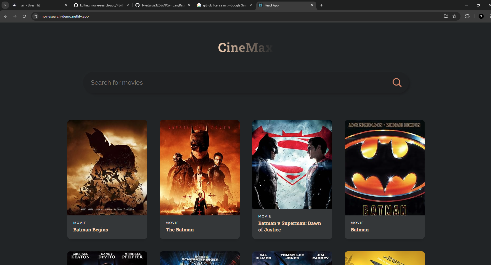

# Movie Search Application

A responsive React.js application that integrates with the **OMDB API** to provide users with detailed movie search results. This project demonstrates dynamic API integration, React components, and a clean, responsive UI.



---

## 🚀 Features
- **Search Functionality**: Easily search for movies by title using the OMDB API.
- **Dynamic Results**: Instantly displays results, including movie posters, titles, and release years.
- **Responsive Design**: Optimized for both desktop and mobile devices for a seamless user experience.

---

## 🛠️ Tech Stack
- **Front-End**: React.js, HTML, CSS
- **API**: OMDB API
- **Build Tool**: Vite

---

## 📂 Project Structure
```
root
├── public/
├── src/
│   ├── components/
│   ├── styles/
│   └── App.js
├── .gitignore
├── package.json
└── README.md
```

---

## 🚀 Getting Started

### Prerequisites
Ensure you have the following installed:
- **Node.js** (v14 or later)
- **npm** or **yarn** package manager

### Installation
1. Clone the repository:
   ```bash
   git clone https://github.com/TylerJarvis3256/movie-search-app.git
   cd movie-search-app
   ```

2. Install dependencies:
   ```bash
   npm install
   ```

3. Add your OMDB API key:
   - Create a `.env` file in the project root:
     ```
     REACT_APP_API_KEY=your-omdb-api-key
     ```

4. Start the development server:
   ```bash
   npm start
   ```

5. Open your browser and navigate to:
   ```
   http://localhost:3000
   ```

---

## 🌟 Demo
[Demo Link](https://moviesearch-demo.netlify.app/)

---

## 📝 To-Do
- [ ] Add filtering options (e.g., genre, release year).
- [ ] Implement pagination for large search results.
- [ ] Enhance UI with loading indicators and animations.

---

## 💬 Contact
- **Author**: Tyler Jarvis
- **Email**: tylerjarvis3256@gmail.com
- **LinkedIn**: [Tyler Jarvis LinkedIn](https://www.linkedin.com/in/tyler-jarvis-b8a72023b/)
- **GitHub**: [Tyler Jarvis GitHub](https://github.com/TylerJarvis3256)
